# Exploratory Analysis of California Single-Family Home Sales

**IDX Exchange Data Science Internship, Week 2 findings memo**
Author: Orcun Tasdemir · October 2026 · Source notebook: [`notebooks/01_exploration.ipynb`](../notebooks/01_exploration.ipynb)

## Purpose

The internship project is to build a model that predicts the final sale price of a single-family home in California from facts about the home that are known before it sells, such as its size, lot, age and location. Before building that model we need to know four things about the data: how much of it there is, how clean it is, how prices are distributed, and which facts about a home go together with its price. This memo reports what the Week 2 exploration found on each of these, and what each finding implies for the cleaning work in Week 3 and the modeling work after it.

## Summary

- The data holds **309,735 single-family home sales** that closed between January 2024 and April 2026.
- **1.6% of these sales contain at least one impossible or suspicious value**, such as a sale price of $1.15 or a house with 175 bathrooms. These will be removed in Week 3.
- **Sale prices are strongly right-skewed.** The median is $894,000, the middle half of sales lies between $625,000 and $1.43 million, and a small number of sales reach tens of millions. The logarithm of price is close to symmetric, so the model should predict the logarithm of price.
- **Living area is the strongest single predictor of price, and location matters about as much.** Among the 15 counties with the most sales, the median price per square foot ranges from $234 (Kern) to $1,168 (San Mateo), a five-fold spread.
- **The asking price nearly equals the sale price** (the median ratio of sale price to asking price is 1.000), so asking price must be kept out of the model. It is unknown for homes that are not for sale, and those homes are part of what the model must price.
- **Sales are seasonal and prices are roughly flat.** About 8,000 homes sell in a typical January and up to 13,800 in spring months, while the median price moved by at most 8% from one year to the next.

## 1. The data

**Source.** The data comes from CRMLS, the California Regional Multiple Listing Service. An MLS is the shared database in which real-estate agents publish homes for sale; when a sale closes, its final price and date are recorded there. IDX Exchange extracted the closed sales into one CSV file per calendar month, and the field definitions come from the documentation of Trestle, the CoreLogic service used for the extraction. Each row is one closed sale, described by about 80 columns.

**Size.** We have 28 monthly files, from January 2024 through April 2026, holding 615,707 closed sales. The close date of every row lies in the month its file is named for, so the files divide the sales cleanly by month of sale. This matters later, because the model will be trained on earlier months and evaluated on the most recent month.

**Restriction to single-family homes.** The files contain every kind of property: houses, condominiums, rentals, land and commercial buildings. The task restricts the project to houses, meaning rows with `PropertyType` equal to "Residential" and `PropertySubType` equal to "SingleFamilyResidence".

| Step | Rows kept | Rows removed | Share of all rows |
|---|---:|---:|---:|
| All closed sales | 615,707 | | 100.0% |
| Keep `PropertyType` = Residential | 414,054 | 201,653 | 67.2% |
| Keep `PropertySubType` = SingleFamilyResidence | 309,735 | 104,319 | 50.3% |

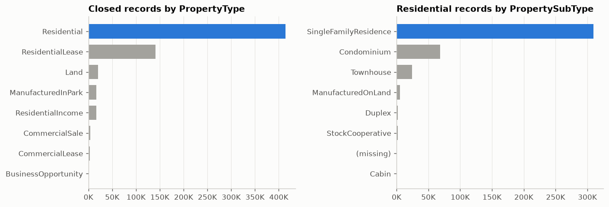

Every number in the rest of this memo refers to these 309,735 single-family sales.

**The monthly files have different columns.** 76 columns appear in every file, and 8 appear in only some files. When the files are stacked into one table, a column that a file lacks is empty for all of that file's rows, so missing values in these 8 columns say which file a row came from and nothing about the home.

| Column | Files containing it | First month | Last month |
|---|---:|---|---|
| `BuyerAgencyCompensation`, `BuyerAgencyCompensationType` | 4 | Jan 2024 | Apr 2024 |
| `latfilled`, `lonfilled` | 7 | Jan 2024 | Jan 2025 |
| `ListAgentAOR`, `BuyerAgentAOR` | 24 | May 2024 | Apr 2026 |
| `OriginatingSystemName`, `OriginatingSystemSubName` | 3 | Feb 2026 | Apr 2026 |

The buyer-agent compensation columns stop after April 2024, which matches the 2024 change in industry rules that moved buyer-agent pay out of the MLS. The `latfilled` and `lonfilled` columns occur only in the 7 files whose names end in `_filled`. They are true/false markers, and they appear to record which coordinates were filled in afterwards (for example by looking up the address) instead of being entered by the agent.

## 2. Missing values

For each column, we computed the share of the 309,735 sales in which the column is empty.

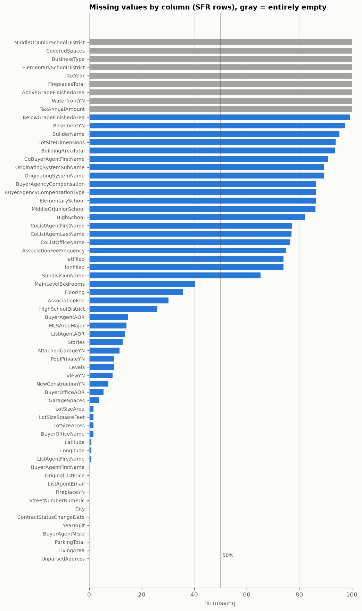

**Empty columns.** 9 columns are empty in every single-family row: `WaterfrontYN`, `FireplacesTotal`, `AboveGradeFinishedArea`, `TaxAnnualAmount`, `TaxYear`, `ElementarySchoolDistrict`, `MiddleOrJuniorSchoolDistrict`, `BusinessType` and `CoveredSpaces`. They carry no information and can be dropped. About 20 more columns are empty in over half the rows, mostly names of co-agents, schools and subdivisions.

**The core facts about a home are nearly complete.** These are the columns most likely to enter the model:

| Column | Meaning | Missing |
|---|---|---:|
| `BedroomsTotal` | number of bedrooms | 0.00% |
| `BathroomsTotalInteger` | number of bathrooms, as a whole number | 0.02% |
| `LivingArea` | interior living space in square feet | 0.05% |
| `YearBuilt` | year of construction | 0.07% |
| `Latitude`, `Longitude` | coordinates of the home | 0.88% |
| `LotSizeSquareFeet` | land area in square feet | 1.7% |
| `GarageSpaces` | number of garage spaces | 3.7% |
| `ViewYN`, `PoolPrivateYN` | has a view; has a private pool | 8.9%, 9.6% |
| `Stories` | number of stories | 12.7% |
| `AssociationFee` | homeowners-association fee | 30.2% |

**Missing rates are stable over time, with two exceptions.** Coordinates are missing for 1.8% of 2024 sales and almost none afterwards, and the missing rates of `Stories` and `PoolPrivateYN` dropped from 15.1% and 11.8% in 2024 to about 11% and 8% in 2025 and 2026. A column whose missing rate changes over time should be handled with care, because the months used for training and the month used for evaluation would see different amounts of missing data.

## 3. Records that cannot be true

A model learns from every row it is given, including rows with typing mistakes, so impossible records need to be found before training. We checked the single-family sales against 21 conditions, each describing a value that is impossible or very unlikely. At this stage records were only counted; Week 3 will remove them and report how many rows each removal step drops.

| Condition | Sales | Share |
|---|---:|---:|
| Sale price missing or at most $0 | 3 | 0.001% |
| Sale price above $0 and below $10,000 | 7 | 0.002% |
| Sale price above $50 million | 31 | 0.01% |
| Living area missing or at most 0 sq ft | 292 | 0.09% |
| Living area above 0 and below 300 sq ft | 25 | 0.01% |
| Living area above 20,000 sq ft | 13 | 0.004% |
| Price per square foot below $50 | 139 | 0.04% |
| Price per square foot above $5,000 | 114 | 0.04% |
| Zero bedrooms | 176 | 0.06% |
| Zero bathrooms | 132 | 0.04% |
| More than 15 bedrooms or more than 15 bathrooms | 29 | 0.01% |
| Year built before 1850 or after the year of sale | 9 | 0.003% |
| Close date before the listing date | 44 | 0.01% |
| Close date before the date the purchase contract was signed | 196 | 0.06% |
| Negative days on market | 41 | 0.01% |
| Coordinates missing | 2,712 | 0.88% |
| Coordinates outside California | 76 | 0.03% |
| State recorded as other than California | 22 | 0.01% |
| Lot size in square feet differs by more than 1% from lot size in acres × 43,560 | 605 | 0.20% |
| Row is an exact copy of another row | 29 | 0.01% |
| Same listing identifier appears in more than one row | 524 | 0.17% |

Price per square foot is the sale price divided by the living area. It is useful for finding errors that the sale price alone hides: a $500,000 sale is ordinary, but a $500,000 sale of a 50 sq ft house points to a mistyped area.

**Altogether 4,919 sales (1.6%) meet at least one condition.** Most are rare, but some errors are extreme: the largest recorded sale price is $989.5 million, the largest living area is 123,764 sq ft, the largest bathroom count is 175, and the largest lot is 2.1 billion sq ft. Several of the out-of-state coordinates look like latitude and longitude typed into each other's fields.

**Repeated listings.** `ListingKey` is the identifier the MLS gives each listing, so each value should occur in exactly one row. In our data, 260 identifiers occur twice, giving the 524 rows in the table above. For 29 of them both rows are identical and come from the same monthly file. For the other 231, the two rows come from different monthly files and carry different close dates, and in 59 of those cases also different sale prices. These look like sales that were corrected or recorded again after the first monthly extract. They matter for evaluation: if one copy falls in the training months and the other in the evaluation month, the model is scored on a sale it has already seen. Week 3 will therefore keep one row per identifier (the most recent one is a reasonable default) before splitting the data by month.

## 4. Sale price

The column the model must predict is `ClosePrice`, the final agreed sale price. Below, the "*p*-th percentile" means the price below which *p*% of sales fall, so the 50th percentile is the median.

| Statistic | Sale price |
|---|---:|
| 0.5th percentile | $190,000 |
| 5th percentile | $367,000 |
| 25th percentile | $625,000 |
| **Median** | **$894,000** |
| 75th percentile | $1,430,000 |
| 95th percentile | $3,175,000 |
| 99.5th percentile | $8,498,000 |
| Mean | $1,297,557 |

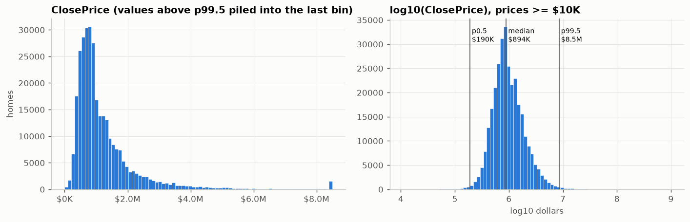

The distribution has a long right tail: the mean is 45% above the median, and the skewness (a measure of asymmetry that is 0 for a symmetric distribution) is 132. After taking the base-10 logarithm of price, the skewness drops to 0.55 and the histogram (right panel) is close to a bell shape.

**Why predict the logarithm of price.** In real estate, an error of $20,000 is negligible on a $2 million house and large on a $200,000 house, so errors are best measured as a percentage of the price. A model that predicts the logarithm of price makes errors that are roughly percentages, and its fit is not dominated by the few most expensive houses. For this reason the linear model planned for Week 4 should predict the logarithm of price.

**Trimming extreme prices.** The internship's best-practices document asks us to drop sales below the 0.5th and above the 99.5th percentile of price. Over all 28 months these cutoffs are $190,000 and about $8.5 million. In Week 3 the cutoffs must be recomputed from the training months only and then applied unchanged to the evaluation month, so that no information about the evaluation month influences which training data we keep.

## 5. Characteristics of the homes

The table describes the typical house through the median and the middle 50% of values (from the 25th to the 75th percentile).

| Characteristic | Median | Middle 50% of homes |
|---|---:|---|
| Living area | 1,804 sq ft | 1,376 to 2,421 sq ft |
| Bedrooms | 3 | 3 to 4 |
| Bathrooms | 2 | 2 to 3 |
| Lot size | 7,245 sq ft | 5,663 to 10,350 sq ft |
| Year built | 1976 | 1956 to 1998 |
| Price per square foot | $533 | $348 to $751 |

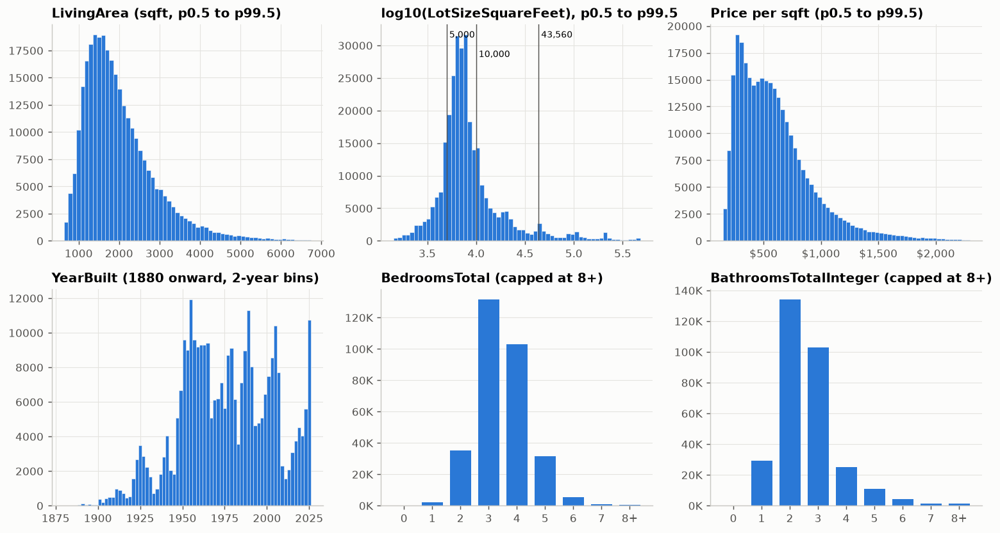

- **Living area** is right-skewed in the same way as price, with most homes between 1,000 and 3,000 sq ft. The logarithm of living area is a natural model input.
- **Lot size** is even more skewed and is shown on a logarithmic scale. Most lots lie between 5,000 and 10,000 sq ft, and a long tail reaches into rural parcels of many acres (one acre is 43,560 sq ft).
- **Year built** shows waves of construction: a large peak in the 1950s, smaller peaks in the late 1970s, late 1980s and mid-2000s, and a spike in 2024 and 2025 made up of newly built homes sold for the first time.
- **Bedrooms and bathrooms** are concentrated: 76% of homes have 3 or 4 bedrooms, and 77% have 2 or 3 bathrooms.

## 6. What goes together with price

To measure how strongly two columns move together we use the **Spearman correlation**. It is the ordinary correlation computed on the ranks of the values instead of the values themselves, so it equals 1 when one column always increases with the other, whatever the shape of that increase. We use it because price, area and lot size are so skewed that the ordinary correlation would be driven by a few extreme houses. For this section, sales below the 0.5th or above the 99.5th percentile of price or of living area were set aside.

**Living area.** The Spearman correlation between living area and price is 0.49. The plot below shows both on logarithmic scales, where the relationship is roughly a straight line. The vertical spread is wide: a 1,500 sq ft house can sell for $300,000 or for over $2 million. Most of this spread comes from location, which Section 7 examines.

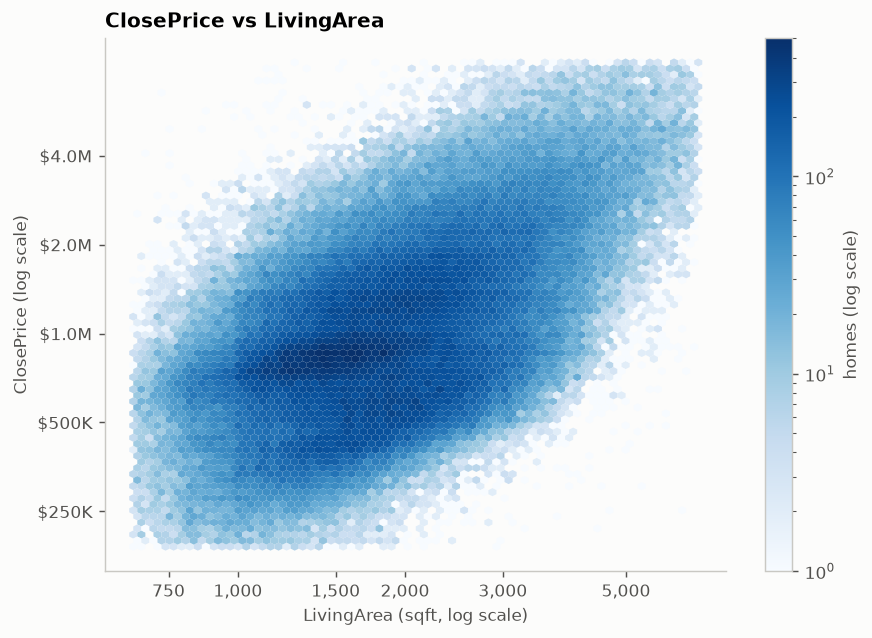

**Bedrooms and bathrooms.** The median price rises steadily with the number of bathrooms (from $790,000 at 2 bathrooms to $3.4 million at 6 or more) and more slowly with the number of bedrooms. Both counts are strongly tied to living area: their Spearman correlations with living area are 0.69 for bedrooms and 0.81 for bathrooms. They therefore repeat much of what living area already says, and in a linear model, inputs that move together this closely make the individual coefficients unstable and hard to interpret.

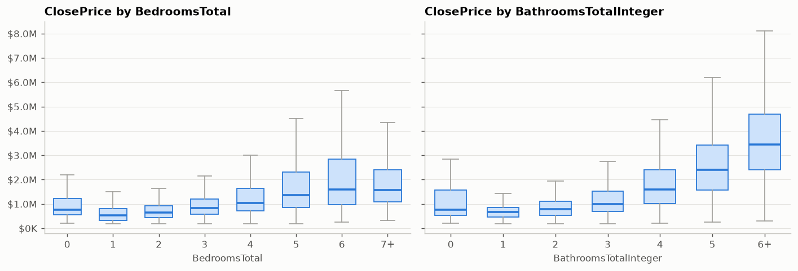

**All numeric columns together.** The bar chart ranks the numeric columns by their Spearman correlation with price. Living area (0.49), bathrooms (0.45) and bedrooms (0.34) lead among the facts about the house itself. Latitude and longitude show weak correlations (−0.09 and −0.27), because price does not rise steadily in any one compass direction; Section 7 shows that location still matters a great deal. The full table of pairwise correlations is in the notebook and in [`figures/correlation_heatmap.png`](figures/correlation_heatmap.png).

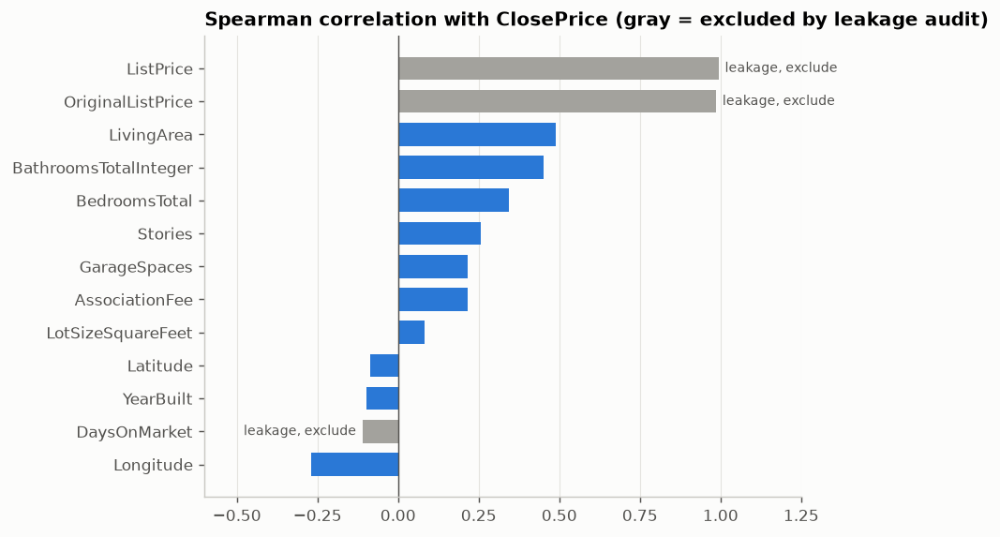

**Columns that reveal the answer.** The chart draws three bars in gray: `ListPrice`, `OriginalListPrice` and `DaysOnMarket` (the number of days the home was listed before it sold). These are columns that *leak* the answer, meaning their values are set during the sale process, so they are unknown for a house that is not being sold. The asking price is the clearest case. `ListPrice` (the current asking price) and `OriginalListPrice` (the first asking price) have Spearman correlations of 0.99 with the sale price. The histogram below shows the ratio of sale price to asking price: its median is exactly 1.000, 75% of homes sell within 5% of asking, and 43% sell above asking.

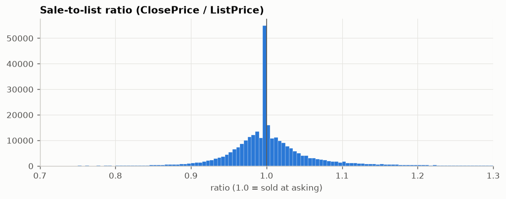

A model given the asking price would mostly copy it, and it could not price a home that is not listed for sale, which is part of the task. The best-practices document therefore excludes the asking-price columns, `DaysOnMarket` and any fields recorded at or after closing. The buyer-agent compensation columns from Section 1 fall in the last group, since they are agreed as part of the sale.

**Yes/no features.** The table compares homes with and without a feature. Each difference combines the effect of the feature itself with the effect of where such homes are and how large they are, since features cluster by location and size: pools and views, for example, are more common in some regions than in others.

| Feature | Share with feature | Median price with / without | Median $ per sq ft with / without |
|---|---:|---|---|
| Private pool | 14.6% | $1,100,000 / $825,000 | $498 / $509 |
| View | 54.7% | $900,000 / $868,000 | $497 / $564 |
| Attached garage | 74.2% | $895,000 / $890,000 | $499 / $642 |
| Fireplace | 72.9% | $1,000,000 / $720,000 | $542 / $500 |
| New construction | 3.6% | $645,000 / $895,000 | $308 / $538 |

Homes with a pool sell for more, but at a slightly lower price per square foot, which suggests that pools mainly come with larger houses. Newly built homes sell for less than older ones, most likely because most new single-family construction happens in lower-priced inland areas.

## 7. Location

The data covers 62 counties, but sales concentrate in Southern California: Los Angeles, Riverside, San Diego, San Bernardino and Orange counties together account for 70% of all single-family sales.

| County | Sales | Median price | Median $ per sq ft |
|---|---:|---:|---:|
| Los Angeles | 73,371 | $990,000 | $628 |
| Riverside | 46,493 | $630,000 | $320 |
| San Diego | 32,959 | $1,050,000 | $596 |
| San Bernardino | 32,258 | $547,000 | $326 |
| Orange | 28,575 | $1,380,000 | $704 |
| Alameda | 14,731 | $1,300,000 | $752 |
| Contra Costa | 14,345 | $895,000 | $530 |
| Santa Clara | 12,518 | $1,903,250 | $1,102 |
| Ventura | 9,548 | $950,000 | $532 |
| San Mateo | 5,280 | $2,000,500 | $1,168 |
| San Luis Obispo | 4,954 | $925,000 | $541 |
| Butte | 3,349 | $434,990 | $281 |
| Monterey | 3,317 | $940,000 | $580 |
| Kern | 3,187 | $385,000 | $234 |
| Merced | 2,472 | $415,000 | $259 |

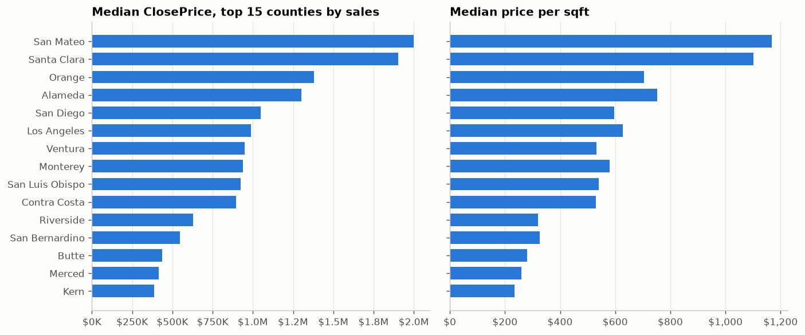

Price per square foot divides out the size of the house, so its five-fold range across these counties, from $234 in Kern to $1,168 in San Mateo, measures how much location alone changes the price of the same amount of house.

The left panel of the map shows the median price per square foot in small hexagonal cells, drawn only for cells with at least 5 sales. The right panel is a street map of exactly the same area, so each cell can be matched to a place by looking across. The most expensive areas are the San Francisco Bay Area (especially the Peninsula and Santa Clara County) and the coast of Los Angeles and Orange counties. Prices fall quickly moving inland.

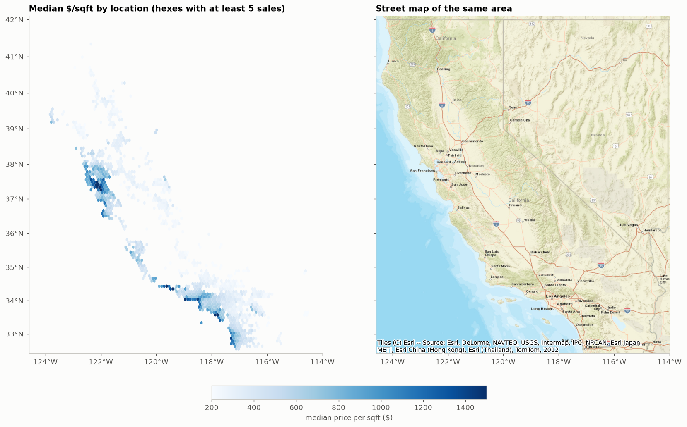

This is why the weak correlations of latitude and longitude with price, seen in Section 6, understate the importance of location. Price depends on location through local clusters, which a straight-line function of latitude and longitude cannot represent. Two remedies are planned. First, models built from decision trees can split the map into regions on their own. Second, location can be summarized in new columns, for example the county, the ZIP code, or the median price per square foot in the ZIP code computed from the training months. The Week 6 plan adds school districts in the same spirit.

## 8. Changes over time

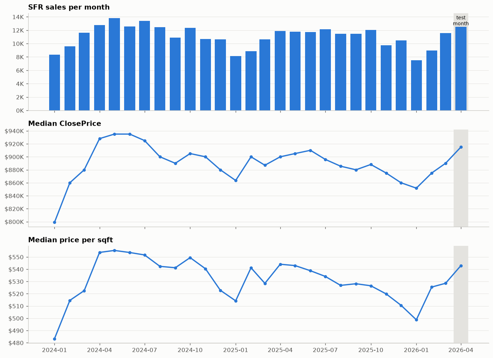

**Seasonality.** Sales volume follows a yearly cycle. January is the slowest month (7,490 sales in January 2026, 8,322 in January 2024), volume rises through spring, and May 2024 was the busiest month at 13,831 sales. The median price follows a smaller cycle with a spring peak:

| Month | Average sales per month | Median price |
|---|---:|---:|
| January | 7,985 | $835,000 |
| April | 12,372 | $915,000 |
| June | 12,123 | $925,000 |
| October | 12,188 | $900,000 |
| December | 10,539 | $869,450 |

**Trend.** Prices were roughly flat over the 28 months. Comparing each month with the same month a year earlier, the median price changed by between −3.2% and +8.1%. The largest change is the rise from January 2024 ($799,000) to January 2025. This rise is real and is unrelated to a change in which counties were selling, because the median price also rose within each large county over that year: Los Angeles from $899,000 to $965,000, Orange from $1.30 million to $1.40 million, and San Diego from $950,000 to $1.03 million. From spring 2025 to early 2026 the median was between 1.1% and 3.2% lower than a year earlier, and it turned positive again in March and April 2026.

**What this means for evaluation.** The model will be evaluated on the most recent month, April 2026, and trained on the months before it. April 2026 had 12,490 sales at a median price of $915,000, close to the seasonal peak. Two consequences follow. The model should know the month of sale, so that it can account for the seasonal price cycle. And since a single evaluation month falls in a single season, the best-practices document's advice to repeat the evaluation at two or three earlier cutoff months is especially relevant: it shows whether the model works equally well in slow winter months.

## 9. Plan for Week 3

The findings above translate into the following preprocessing steps.

1. **Combine the files consistently.** Align the columns of all monthly files and drop the 9 empty columns.
2. **Remove repeated sales.** Keep one row per `ListingKey`, the most recent, before any split by month.
3. **Remove impossible records.** Use the conditions of Section 3, and report the number and share of rows each condition removes.
4. **Split by time.** Evaluation month: April 2026. Month for choosing model settings: March 2026. Training months: the months before March 2026; how many months to use is itself a setting to try out.
5. **Trim extreme prices using training months only.** Compute the 0.5th and 99.5th percentiles of price, and a matching rule on price per square foot, from the training months, then apply the same cutoffs to the other months.
6. **Handle missing values.** Drop columns that are empty in more than about half the rows; fill the remaining gaps using values learned from the training months only; and for yes/no columns such as pool, view and stories, add a column recording whether the value was missing, since missingness itself may relate to price.
7. **Fix coordinates.** For sales with missing or out-of-state coordinates, either estimate the location from the ZIP code or drop the sale.
8. **Prepare candidate inputs.** Logarithm of living area and of lot size, bedrooms, bathrooms, age of the house at the time of sale, garage spaces, stories, pool and view, county and ZIP code, and month of sale encoded as a point on a circle (sine and cosine), so that December and January come out as neighbors.

## 10. Open questions

- **Reliability of filled-in coordinates.** The `_filled` files mark some coordinates as filled in afterwards. Are those coordinates as accurate as agent-entered ones?
- **Which repeated record to keep.** Keeping the most recent record of a repeated listing assumes later records are corrections. A short check of a few examples against the source would confirm this.
- **Listing files.** The data also includes monthly files of listings (`CRMLSListing*`), which this analysis did not use. They could describe market conditions such as the number of homes for sale. The January 2026 listing file holds only 2,606 rows, against roughly 19,000 to 40,000 in the other months, so that file may be incomplete.

## Reproducing this analysis

1. Install the packages listed in [`requirements.txt`](../requirements.txt) (Python 3.11).
2. Put the monthly `CRMLSSold*.csv` files in a folder named `csv/` at the top of the repository. The data is kept out of the repository.
3. Run `jupyter nbconvert --to notebook --execute --inplace notebooks/01_exploration.ipynb`. This recreates every table in the notebook and every chart in `reports/figures/`. The street map is downloaded from Esri while the notebook runs, so an internet connection is needed.
