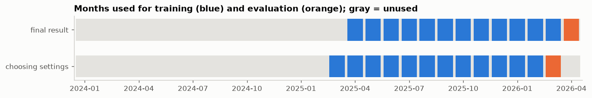
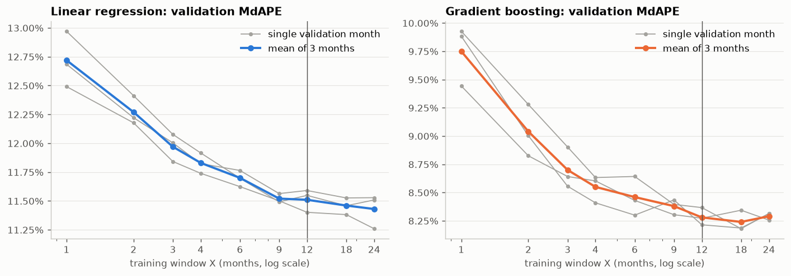

# Preparing California Single-Family Home Sales for Modeling

**IDX Exchange Data Science Internship, Week 3 memo**
Author: Orcun Tasdemir · October 2026 · Source notebook: [`notebooks/02_preprocessing.ipynb`](../notebooks/02_preprocessing.ipynb) · Code: [`src/preprocessing.py`](../src/preprocessing.py)

## Purpose

The project's goal is a model that predicts the final sale price of a California single-family home from facts known before the sale. The [Week 2 memo](01_exploration_memo.md) described the raw data: 309,735 single-family sales from January 2024 to April 2026, a small share of impossible records, strongly skewed prices, and a few columns that reveal the sale price. This memo describes how that data was turned into a training set and a test set that a model can use, and how the length of the training period was chosen.

The internship's best-practices document, IDX Exchange's written standard for building price-prediction models, sets three requirements that shape every step below:
1. **Evaluate on the future.** The model is trained on earlier months and scored on a later month, as it would be used in practice.
2. **Learn nothing from the evaluation month.** Any quantity computed from data, such as a median used to fill gaps or a price cutoff for outliers, must be computed from the training months only.
3. **Account for every removed row.** Each cleaning step reports how many rows it removes.

## Summary

- **Cleaning removed 873 of the 309,735 sales (0.28%)**, mostly implausible living areas and older copies of sales recorded twice. Another 431 single impossible values (such as a lot of 0 sq ft) were blanked and later filled in, so the rest of their row could still be used.
- **The model receives 17 facts about each home**: living area, lot size, bedrooms, bathrooms, year built, garage spaces, stories, monthly association fee, latitude, longitude, five yes/no features (pool, view, attached garage, fireplace, newly built), county and ZIP code. Asking price, days on market and similar sale-process fields are removed from the cleaned file entirely.
- **The test month is April 2026**, the most recent month, and it has not been used yet. Settings are chosen by the error on earlier months instead (March 2026, and for the training-window length also January and February 2026).
- **The model will train on the 12 months before the month it predicts.** Longer windows lowered the error sharply up to about 9 months; beyond 12 months the further gain was under 0.1 percentage points, no larger than the normal variation from one month to the next.
- **The final training set has 128,330 sales** (April 2025 to March 2026), and the test set has 12,268 sales.
- As a preview, two quick models trained this way price half of the homes within 11.5% (linear regression) and within 8.3% (gradient-boosted trees) of their sale price, on the months used for choosing settings.

## 1. How the steps are organized

Requirement 2 above decides the order of the work. Some steps follow fixed rules and look at one row at a time; others compute a quantity from many rows. The first kind cannot carry information from one month into another, so it can be applied to all months at once. The second kind must be computed from the training months only. This gives three stages:

1. **Fixed cleaning rules** (Section 2), applied once to all 28 months.
2. **The split by month and the outlier cutoffs** (Sections 4 and 5). The months are divided into training and evaluation months, and the price cutoffs for outliers are computed from the training months.
3. **The preprocessor** (Section 6), which fills missing values, converts categories to numbers and rescales numbers. It is a scikit-learn `ColumnTransformer`, an object that learns its statistics when it is *fit* on training rows and then applies the same statistics, unchanged, when it *transforms* evaluation rows.

All three stages are implemented as functions in `src/preprocessing.py`, so the modeling work of later weeks uses exactly the same steps.

## 2. Fixed cleaning rules

Some terms first. A *listing* is a home's entry in the MLS, the shared database in which agents publish homes for sale. A sale *closes* on the day ownership transfers, and the *purchase contract* is the agreement between buyer and seller, usually signed a month or more before closing.

The rules below are applied in order, and each is based on a Week 2 finding. The share removed is measured against the 309,735 single-family sales.

| Rule | Rows removed | Share |
|---|---:|---:|
| Remove exact duplicate rows | 29 | 0.009% |
| Remove older copies of the same listing, keeping the most recent | 235 | 0.076% |
| Remove sales with a missing or non-positive price | 2 | 0.001% |
| Remove sales recorded outside California | 22 | 0.007% |
| Remove sales that closed before the listing started | 44 | 0.014% |
| Remove sales that closed before the purchase contract was signed | 194 | 0.063% |
| Remove homes with no living area, under 300 sq ft or over 20,000 sq ft | 328 | 0.106% |
| Remove homes with more than 15 bedrooms or bathrooms | 19 | 0.006% |
| **Total** | **873** | **0.28%** |

**Sales recorded twice.** Each listing in the MLS has an identifier, `ListingKey`, which should occur in exactly one row. Week 2 found 260 identifiers occurring in 524 rows (a few occur three times). The first rule removes 29 of these rows, which are exact copies of another row; the second rule removes the remaining 235 extra rows, leaving one row per identifier. A closer look this week showed that for 259 of the 260 identifiers, the repeated rows describe the same home (same address and living area), and the later row usually carries an updated close date. The later monthly file therefore appears to correct the earlier one, so the most recent record is kept; the one identifier with two different addresses is treated the same way. Doing this before splitting by month matters: if the two copies landed in different months, the model could be scored on a sale it had already seen in training.

**Single values instead of whole rows.** Some problems affect one value in an otherwise usable row. Removing the row would waste its other columns, so these values are set to missing and filled in later by the preprocessor:

| Value set to missing | Count |
|---|---:|
| 0 bedrooms | 121 |
| 0 bathrooms | 78 |
| Year built before 1850 or after the year of sale | 8 |
| Coordinates outside California | 62 |
| Lot size of 0 sq ft | 162 |

Two columns can also be partly filled from a second column that records the same fact: 20 missing lot sizes were filled from the lot size in acres (1 acre = 43,560 sq ft), and 5,819 missing story counts from the `Levels` text field ("One", "Two", "ThreeOrMore").

## 3. What the model receives

The model receives 17 inputs per home. Fifteen are columns of the original files; two are derived: the 5-digit ZIP code, taken from the first five characters of the `PostalCode` column (which sometimes holds a 9-digit ZIP code), and the monthly association fee. The fee needs conversion because `AssociationFee` is reported per month, quarter, half-year or year; it is divided by the number of months in its period, and a positive fee with no stated period (712 homes) is assumed to be monthly.

| Input | Missing after cleaning |
|---|---:|
| Living area (sq ft) | 0% |
| Lot size (sq ft) | 1.8% |
| Bedrooms; bathrooms | 0.04%; 0.04% |
| Year built | 0.06% |
| Garage spaces | 3.7% |
| Stories | 10.8% |
| Association fee per month | 30.1% |
| Latitude and longitude | 0.89% |
| Has a private pool; has a view | 9.6%; 8.9% |
| Garage attached to the house; has a fireplace; newly built | 11.6%; 0.06%; 7.3% |
| County; ZIP code | 0%; 0% |

**What is excluded, and why.** The remaining columns fall into these groups:
- **Columns that reveal the sale price** (5): asking price, original asking price, days on market and the two buyer-agent compensation fields. Their values are set during the sale process, so they are unknown for a home that is not for sale, and the model must also price such homes. The cleaned file `sfr_clean.csv` does not contain them, so no later notebook can use them by accident.
- **Empty or mostly empty columns** (27): 8 are empty for every single-family sale, and 19 more are over 50% empty, such as school names and co-agent names. (Week 2 counted 9 empty columns; one of them, `WaterfrontYN`, has 136 values, so it is counted here among the mostly empty columns.)
- **Agent and office names** (12): they describe who sold the home, not the home itself.
- **Identifiers, system fields and process dates** (10): the process dates were used by the cleaning rules in Section 2.
- **Columns repeating a kept fact** (10), such as lot size in acres, city and street address.
- **Left for later weeks** (3): flooring, main-level bedrooms and high-school district. Week 6 adds school districts by matching each home's coordinates to official school-district boundaries, and engineered features such as the age of the home at sale are also left for Week 6, so that their contribution can be measured against this feature set.

## 4. Training, validation and test months

Following requirement 1, the data is split by month:

- The **test month** is the most recent month, April 2026. It is used once, at the end of the project, to report the final result.
- The **validation month** is March 2026. Choices are judged by their error on this month, so that no choice is made by looking at the test month. For the training-window length, Section 7 also uses January and February 2026 as additional validation months, because one month alone can be lucky or unlucky.
- The **training months** are the X months right before the month being predicted. The value of X is chosen in Section 7.

The same pattern is used twice, shifted by one month. To choose settings, a model is trained on the X months before March 2026 and scored on March 2026. For the final result, it is trained on the X months before April 2026, which now include March, and scored on April 2026. The chart shows both for X = 12.

## 5. Outlier cutoffs from the training months

The best-practices document asks us to remove sales below the 0.5th and above the 99.5th percentile of price (the prices below which 0.5% and 99.5% of sales fall), with the percentiles computed from the training months only. We also apply the same percentiles to price per square foot (price divided by living area), because it catches errors that the price alone hides, such as an ordinary price paired with a mistyped living area.

For the final split, the training months give these cutoffs, which are applied unchanged to both sets:

| | Lower cutoff | Upper cutoff |
|---|---:|---:|
| Price | $185,000 | $8,600,000 |
| Price per sq ft | $144 | $2,299 |

They remove 1.50% of the training sales (130,281 to 128,330) and 1.66% of the test sales (12,475 to 12,268). The price cutoffs alone account for about 1% in each set, as two 0.5% tails should; the price-per-square-foot cutoffs remove a further 0.52% of training sales and 0.66% of test sales. Since the test month loses about the same shares as the training months, its extreme sales resemble theirs.

## 6. Filling gaps, converting categories and rescaling

The preprocessor turns the 17 inputs into a table of numbers. It treats each group of inputs differently; the reason for each step is explained after the table.

| Inputs | Steps, in order |
|---|---|
| Living area, lot size | Limit each value to the range from the training 0.5th to the 99.5th percentile; take the logarithm of 1 + value; fill missing values with the training median and add a 0/1 column marking them; standardize |
| Bedrooms, bathrooms, year built, garage spaces, stories, monthly fee | The same steps without the logarithm |
| Latitude, longitude | Fill missing coordinates with the training median of the home's ZIP code (or of its county if the ZIP code has no training homes, or of all training homes as a last resort); add a 0/1 column marking filled rows; standardize |
| Five yes/no features (pool, view, attached garage, fireplace, newly built) | Yes = 1 and no = 0; missing = 0 plus a 0/1 column marking it |
| County | One 0/1 column per county; counties with fewer than 50 training sales share a single column |
| ZIP code | Target encoding (explained below), then standardize |

Each step has a reason grounded in the Week 2 findings:
- **Limiting extreme values** keeps typing errors, such as a 2.1-billion-sq-ft lot or 600 garage spaces, from distorting the model.
- **The logarithm** makes the right-skewed size measures roughly symmetric, which suits a linear model.
- **Standardizing** subtracts the training mean and divides by the training standard deviation. It puts all inputs on a common scale, so that the coefficients of a linear model can be compared, and so that a penalized linear model (one that shrinks large coefficients, such as ridge regression) treats all inputs alike. Tree models are unaffected by it.
- **The 0/1 missing columns** let the model learn whether a missing value itself goes together with price.
- **Filling coordinates by ZIP code** places a home within a few miles of its true location, whereas a statewide median would place it in the middle of California.

**Target encoding.** There are about 3,000 ZIP codes, too many for one 0/1 column each. Target encoding replaces each ZIP code with a single number: the average log sale price of training homes in that ZIP code, pulled toward the overall average when the ZIP code has few sales. Computed naively, a home's own price would be part of its own ZIP code's average, which inflates how well the model appears to fit. To prevent this, the training rows are divided into 5 parts and each part is encoded using averages from the other 4 parts only. ZIP codes that never occur in training receive the overall average; in the April 2026 test month this happens for 19 homes (0.15%).

**Checks on the result.** Fit on the final training set, the preprocessor produces 65 numeric columns with no missing values. A missing-value marker column is added only for an input that has missing values in the training rows, so living area, which has none after cleaning, gets no marker. The 65 columns are: living area and lot size with one marker (3); the six other numbers with six markers (12); latitude, longitude and the filled-coordinates marker (3); the five yes/no features with five markers (10); 36 county columns; and one ZIP column. The standardized columns have mean 0 and standard deviation 1 on the training rows. On the test rows their means lie between −0.01 and 0.05, as expected when test rows are transformed with training statistics instead of their own.

## 7. Choosing the training window

The Week 3 plan leaves the training-window length X open, to be chosen by experiment. Two effects pull in opposite directions. A longer window gives the model more examples, which helps most for rare cases such as small ZIP codes and very large homes. A shorter window keeps the training data closer to current market conditions; prices drift over time, and the model has no input that describes the date of sale.

**The measure.** For each home, the *percentage error* is |predicted price − sale price| / sale price. The **MdAPE** is the median of these percentage errors over all homes in the validation month. The best-practices document names it as the main measure because, unlike a mean, it is barely affected by a few very large errors.

**The experiment.** For each X in {1, 2, 3, 4, 6, 9, 12, 18, 24} months, we trained on the X months before a validation month and computed the MdAPE on that month. To reduce the influence of any single month, this was repeated for three validation months (January, February and March 2026) and the results averaged. The test month was not used.

**The models.** Two quick models were used, only to compare windows: a linear regression (a preview of the Week 4 baseline) and gradient-boosted trees (scikit-learn's `HistGradientBoostingRegressor` with its default settings, except that the number of boosting rounds is set to 300). Both predict the logarithm of price, as recommended in Week 2, and both use the preprocessor of Section 6. Two models were used because the best window could depend on the model: trees can learn location clusters and nonlinear effects that a linear model cannot.

| Window X (months) | 1 | 2 | 3 | 4 | 6 | 9 | 12 | 18 | 24 |
|---|---:|---:|---:|---:|---:|---:|---:|---:|---:|
| Training sales (average) | 8,818 | 17,884 | 28,440 | 39,323 | 62,235 | 96,972 | 127,475 | 191,952 | 263,516 |
| Linear regression MdAPE | 12.72% | 12.27% | 11.97% | 11.83% | 11.70% | 11.52% | 11.51% | 11.46% | 11.43% |
| Gradient boosting MdAPE | 9.75% | 9.04% | 8.70% | 8.55% | 8.46% | 8.38% | 8.28% | 8.24% | 8.29% |

The MdAPE values are averages over the three validation months.

For both models the error falls steeply up to about 9 months and is almost flat from 12 months on. Between 12 and 24 months, the average MdAPE changes by less than 0.1 percentage points. The standard deviation of MdAPE across the three validation months, at a fixed window, is also about 0.1 percentage points, so differences of that size cannot be told apart from month-to-month variation.

**The choice is X = 12.** The rule applied was: take the shortest window whose average MdAPE is within 0.1 percentage points of the best window, for both models at once. Using the unrounded averages: for gradient boosting the best window is 18 months (8.237%), and 12 months (8.285%) is 0.048 points behind; for linear regression the best is 24 months (11.432%), and 12 months (11.513%) is 0.081 points behind. Nine months is 0.141 points behind for gradient boosting, so it fails the rule. Twelve months also has a natural meaning: the training data contains each calendar month exactly once, so the seasonal cycle found in Week 2 is represented evenly.

The choice is tied to the current inputs. If Week 6 adds inputs that describe the time of sale, older months become more useful and a longer window may then be better, so X should be checked again at that point.

## 8. Outputs

The notebook writes three files to `data/processed/`. They contain data, so they stay on the local machine and are kept out of the repository:

| File | Contents | Rows |
|---|---|---:|
| `sfr_clean.csv` | All 28 months after the fixed cleaning rules, with identifiers, date, the 17 inputs and the sale price | 308,862 |
| `train.csv` | Final training set: April 2025 to March 2026, after the outlier cutoffs | 128,330 |
| `test.csv` | Final test set: April 2026, after the same cutoffs | 12,268 |

The file `config/split_config.json` is committed. It contains no data, only the settings needed to rebuild the splits exactly: the chosen window, the months of each set, the cutoffs, the list of inputs and the experiment results. The split for choosing settings, described in Section 4 (train on March 2025 to February 2026, validate on March 2026; 127,358 and 11,354 sales), is what Weeks 4 to 7 use for tuning; it is rebuilt with `make_split(clean_df, '2026-03', 12)` from `src/preprocessing.py`.

## 9. Next steps (Week 4)

1. Fit the linear regression baseline with this preprocessor on the split for choosing settings, and report four measures on March 2026: R² (the share of the variation in sale prices that the predictions explain), MAPE (the mean percentage error), MdAPE (the median percentage error) and MAE (the mean absolute error in dollars).
2. Fit it once on the final split and report the same four measures on April 2026. This becomes the baseline result that later models must clearly beat.
3. Repeat the evaluation at two earlier months, as the best-practices document asks, to check that the baseline's accuracy is stable over time.

## 10. Assumptions to revisit

- **The most recent copy of a repeated sale is the correct one.** This is supported by the matching addresses and living areas, but a few cases have different purchase dates or prices and could be checked against the source.
- **A positive association fee with no stated period is monthly.** This affects 712 homes; monthly is by far the most common period among fees with a stated period.
- **The quick models are only a guide.** Their errors were used to compare windows, not as results. Tuned models in later weeks may prefer a slightly different window, which the configuration makes easy to change.

## Reproducing this analysis

1. Install the packages in [`requirements.txt`](../requirements.txt) (Python 3.11).
2. Put the monthly sales files (named `CRMLSSold` followed by the year and month, for example `CRMLSSold202604.csv`) in a folder named `csv/` at the top of the repository.
3. Run `jupyter nbconvert --to notebook --execute --inplace notebooks/02_preprocessing.ipynb`. This rebuilds the three output files, the configuration file and the two charts in about a minute.
